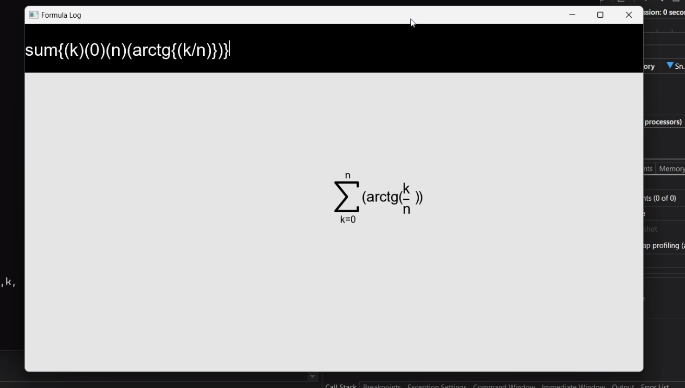

# FormulaEditor
The FormulaEditor app is a user-friendly application designed to assist users in creating complex mathematical formulas and equations effortlessly made in C++, using SFML.

### Mathematical Operators and Symbols
The Formula Editor supports a wide range of mathematical operators and symbols, including:
- Arithmetic operators and symbols: `+`, `-`, `*`, `/`, `=`, `>=` `!=`, `<=`, `>`, `<`
- Exponentiation: `^`
- Square root: `sqrt{()}` (e.g., `sqrt{(2)}`)
- Fractions: `numerator/denominator` (e.g., `1/2`)
- Trigonometric functions: `sin{()}`, `cos{()}`, `tan{()}`, `ctg{()}` , `arcsin{()}`, `arccos{()}`, `arctg{()}`, `arcctg{()}`
- Module: `abs{()}`
- Integrals: `primitive{()()}` (e.g., `primitive{(x^2)(dx)}`)
- Definite Integrals: `integral{()()()()}` (e.g., `integral{(0)(1)(sin{(x)})(dx)}`)
- Sums: `sum{()()()}` (e.g., `sum{(k)(0)(n)(arctg{(k/n)})}`)
- Logarithms: `ln{()}`, `log{(base)()}`, `lg{()}` (e.g. `log{(2)(4)}`)
- limits: `lim{()()()}` (e.g. `lim{(x)(0)(sin{(x)})}`)
### Variables and Constants
You can use variables and constants in your formulas:
- Variables: Use any alphanumeric identifier (e.g., `x`, `y`, `z`)

### Pictures

